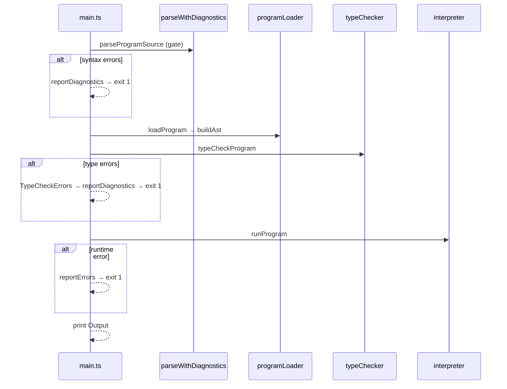

# AstigLang Pipeline

`.stg` source goes through five steps:

```
Source  →  Lex + Parse  →  AST  →  Type check  →  Interpret  →  Output
```

**Full run:** `npm start -- program.stg` (driver: `src/main.ts`)

---

## Commands

| Command | What it does |
|---------|--------------|
| `npm start -- file.stg` | Full pipeline (run a program) |
| `npm run pipeline` | **Presentation demo** — all phases → `.txt` files + console |
| `npm run generate` | Regenerate ANTLR from `grammar/AstigLang.g4` |

**Pipeline demo output** (from `src/pipelineDemo.ts`, written to `text-files/`):

| File | Contents |
|------|----------|
| `text-files/pipeline-output.txt` | All phases combined (best for presentation) |
| `text-files/scanner-output.txt` | Tokens per sample file |
| `text-files/parse.txt` | Parse trees |
| `text-files/ast.txt` | `ProgramNode` ASCII dumps |
| `text-files/interpreter-output.txt` | Type check + print output |
| `text-files/scanner-error-dump.txt` | Lexical errors only |

Sample programs: `demo-examples/math-simple-expression.stg`, `math-complex-expression.stg`, `logical-op-test.stg`, `array-test.stg`

---

## `npm start` flow

```
read .stg
  → parse (syntax gate)           main.ts lines 35–41
  → loadProgram / buildAst        programLoader.ts + ast.ts
  → typeCheckProgram              typeChecker.ts
  → runProgram                    interpreter.ts
  → print output
```

**Parse runs twice on success:** once as an early gate in `main.ts`, again inside `loadProgram()` when building the AST.



---

## Phases

### 1. Lex + Parse

**Goal:** Text → ANTLR parse tree. Bad syntax stops here.

| File | Role |
|------|------|
| `grammar/AstigLang.g4` | Grammar source of truth |
| `generated/grammar/` | ANTLR lexer + parser |
| `src/utils/parseWithDiagnostics.ts` | `parseSourceWithDiagnostics()` |
| `src/utils/diagnostics.ts` | `humanizeAntlrMessage()` |

```
source  →  AstigLangLexer  →  tokens  →  AstigLangParser  →  program()
```

---

### 2. AST

**Goal:** Parse tree → `ProgramNode` (your own AST).

| File | Role |
|------|------|
| `src/ast.ts` | `buildAst()` |
| `src/models/` | AST node types |

Each statement gets a `location` (line/column) for error carets.

---

### 3. Module loading (optional)

**Goal:** Resolve `iHNcHLuHD3s` includes and merge records/functions.

| File | Role |
|------|------|
| `src/programLoader.ts` | `loadProgram()`, `mergeIncludedModules()` |
| `src/utils/moduleScope.ts` | Export vs private functions |

Rules:
- Only the **entry file** may define `mHA1Ns()`.
- `eHXpH0RTz` marks functions callable from other files.
- Missing or circular includes → error during load.

Single file with no includes uses `finalizeStandaloneProgram()`.

---

### 4. Type check

**Goal:** Catch semantic errors before running.

| File | Role |
|------|------|
| `src/typeChecker.ts` | `typeCheckProgram()` |
| `src/utils/typeCheckRecovery.ts` | Report multiple errors in one run |
| `src/classes/TypeEnvironment.ts` | Symbol table (name → type) |
| `src/classes/RecordRegistry.ts` | Record field types |

Checks: undeclared names, type mismatches, redeclarations, `const` rules, function args, records, arrays, `scan` targets.

On failure → `TypeCheckErrors` → `main.ts` prints all diagnostics + recovery note.

**Demo:** `npm start -- test-case/semantic-errors.stg` (7 errors)

---

### 5. Interpret

**Goal:** Run `mHA1Ns()` and collect `pHR!HNTs` output.

| File | Role |
|------|------|
| `src/interpreter.ts` | `runProgram()` |
| `src/classes/RuntimeEnvironment.ts` | Symbol table (name → value) |
| `src/utils/scanUtils.ts` | `scH4nz` stdin |

Only the entry file's `main` body runs. Included files do not auto-execute.

---

## Errors

All errors print **file:line:column**, source line, and caret (when source is available).

| Phase | When | Handled in `main.ts` |
|-------|------|----------------------|
| `lex` / `parse` | Bad token or syntax | `reportDiagnostics` (gate, lines 37–41) |
| `type` | Semantic violation | `TypeCheckErrors` → `reportDiagnostics` |
| `include` | Bad include graph | `reportErrors` → generic `Error` |
| `runtime` | Execution failure | `RuntimeError` or generic `Error` |

**Key files:**

| File | Role |
|------|------|
| `src/utils/diagnostics.ts` | Format messages, carets, recovery footers |
| `src/utils/parseWithDiagnostics.ts` | Collect lex/parse diagnostics |
| `src/utils/typeCheckRecovery.ts` | Continue type check after recoverable errors |
| `src/main.ts` | `reportErrors()` routes each error type |

### Error recovery

| Phase | Behavior |
|-------|----------|
| Lexer | Skips bad input, keeps scanning (`npm run pipeline`) |
| Parser | Collects all syntax errors before exit |
| Type checker | Records each statement error, reports all at end |
| Interpreter | Stops on first error |

Type-check recovery is on by default. Footer:

> Note: Type checker continued after errors and reported all issues found (error recovery).

---

## Data at each stage

| Stage | What you have |
|-------|---------------|
| Source | Plain text |
| Tokens | `VAR_KW`, `IDENTIFIER`, `NUMBER`, … |
| Parse tree | ANTLR `(program …)` tree |
| AST | `ProgramNode`, `StatementNode`, `ExpressionNode` |
| Types | `ResolvedType` in `TypeEnvironment` |
| Runtime | `RuntimeValue` in `RuntimeEnvironment` |

---

## File map

```
grammar/AstigLang.g4
generated/grammar/

src/main.ts                          Driver
src/programLoader.ts                 Parse + includes
src/ast.ts                           Parse tree → AST
src/typeChecker.ts                   Static semantics
src/interpreter.ts                   Execution

src/utils/parseWithDiagnostics.ts    Lex + parse + diagnostics
src/utils/diagnostics.ts             Error formatting
src/utils/typeCheckRecovery.ts       Type-check recovery
src/utils/moduleScope.ts             Export visibility
src/utils/astigTypeUtils.ts          Type helpers
src/utils/scanUtils.ts               scan I/O

src/pipelineDemo.ts                  Unified pipeline demo (scan/parse/ast/interpret)
src/pipelineDemoFiles.ts             Sample programs for demos
src/utils/formatAst.ts                 AST ASCII formatter
src/utils/formatParseTree.ts           Parse tree formatter

src/models/                          AST shapes
src/classes/                         Environments, errors

demo-examples/                       Tours and pipeline demos
test-case/                           One file per rubric construct
text-files/                          Generated pipeline demo output (.txt)
```

---

## Related docs

- `LANGUAGE.md` — syntax and language rules
- `SYNTAX-RULES.md` — do / don't quick reference
- `Criteria.md` — grading rubric
- `README.md` — task list
